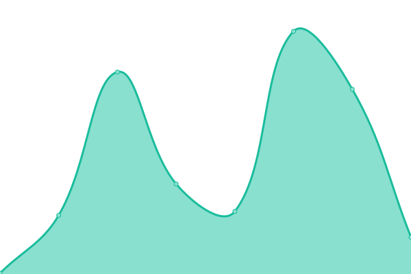
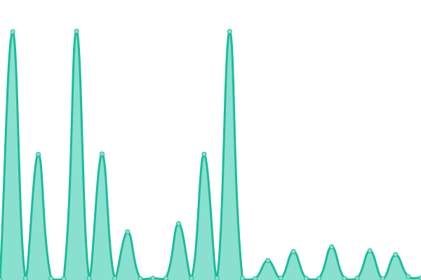
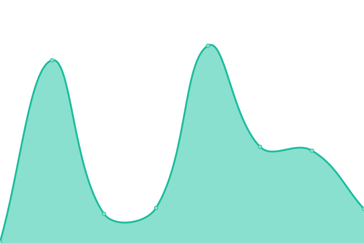

# [📈 Live Status](https://hamboneZA.github.io/caffeine): <!--live status--> **🟨 Degraded performance**

This repository contains the open-source uptime monitor and status page for [hamboneZA](https://hamboneZA.github.io/caffeine), powered by [Upptime](https://github.com/upptime/upptime).

With [Upptime](https://upptime.js.org), you can get your own unlimited and free uptime monitor and status page, powered entirely by a GitHub repository. We use [Issues](https://github.com/hamboneZA/caffeine/issues) as incident reports, [Actions](https://github.com/hamboneZA/caffeine/actions) as uptime monitors, and [Pages](https://hamboneZA.github.io/caffeine) for the status page.

<!--start: status pages-->
<!-- This summary is generated by Upptime (https://github.com/upptime/upptime) -->
<!-- Do not edit this manually, your changes will be overwritten -->
<!-- prettier-ignore -->
| URL | Status | History | Response Time | Uptime |
| --- | ------ | ------- | ------------- | ------ |
|  [Postfix](https://www.google.com) | 🟨 Degraded | [postfix.yml](https://github.com/hamboneZA/caffeine/commits/HEAD/history/postfix.yml) | 

 106ms
     
 | 

<a href="https://hamboneza.github.io/caffeine/history/postfix">100.00%</a>
    

|  [Dovecot](https://en.wikipedia.org) | 🟩 Up | [dovecot.yml](https://github.com/hamboneZA/caffeine/commits/HEAD/history/dovecot.yml) | 

 198ms
     
 | 

<a href="https://hamboneza.github.io/caffeine/history/dovecot">100.00%</a>
    

|  [IMAP](https://news.ycombinator.com) | 🟩 Up | [imap.yml](https://github.com/hamboneZA/caffeine/commits/HEAD/history/imap.yml) | 

 133ms
     
 | 

<a href="https://hamboneza.github.io/caffeine/history/imap">100.00%</a>
    

|  [ClamAV](https://spamassassin.apache.org/) | 🟩 Up | [clam-av.yml](https://github.com/hamboneZA/caffeine/commits/HEAD/history/clam-av.yml) | 

 92ms
     
 | 

<a href="https://hamboneza.github.io/caffeine/history/clam-av">90.47%</a>
    

|  [Nginx Clusters](https://www.google.com) | 🟩 Up | [nginx-clusters.yml](https://github.com/hamboneZA/caffeine/commits/HEAD/history/nginx-clusters.yml) | 

 75ms
     
 | 

<a href="https://hamboneza.github.io/caffeine/history/nginx-clusters">100.00%</a>
    

|  [MySQL Servers](https://en.wikipedia.org) | 🟩 Up | [my-sql-servers.yml](https://github.com/hamboneZA/caffeine/commits/HEAD/history/my-sql-servers.yml) | 

 48ms
     
 | 

<a href="https://hamboneza.github.io/caffeine/history/my-sql-servers">100.00%</a>
    

|  [PostgreSQL](https://news.ycombinator.com) | 🟩 Up | [postgre-sql.yml](https://github.com/hamboneZA/caffeine/commits/HEAD/history/postgre-sql.yml) | 

 114ms
     
 | 

<a href="https://hamboneza.github.io/caffeine/history/postgre-sql">100.00%</a>
    

<!--end: status pages-->

[**Visit our status website →**](https://hamboneZA.github.io/caffeine)

## 📄 License

- Powered by: [Upptime](https://github.com/upptime/upptime)
- Code: [MIT](./LICENSE) © [hamboneZA](https://hamboneZA.github.io/caffeine)
- Data in the `./history` directory: [Open Database License](https://opendatacommons.org/licenses/odbl/1-0/)
